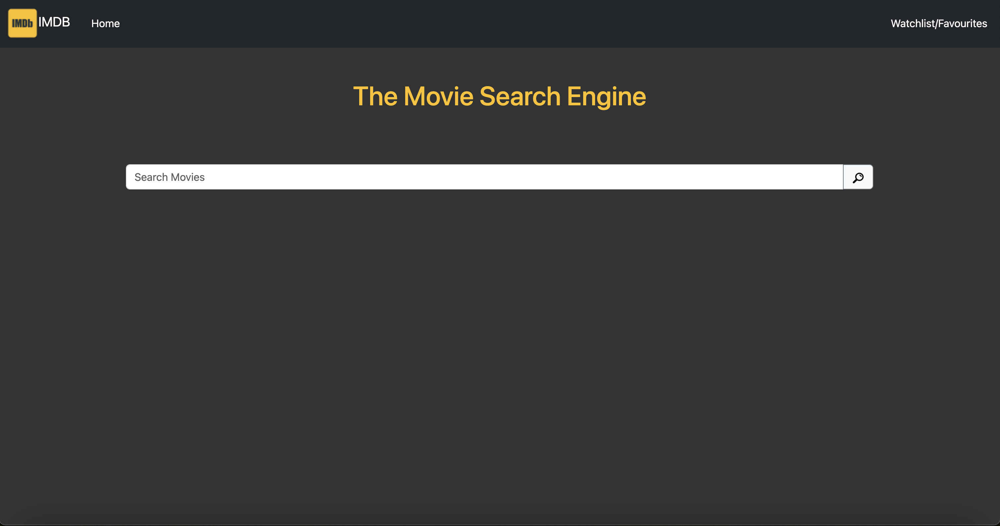
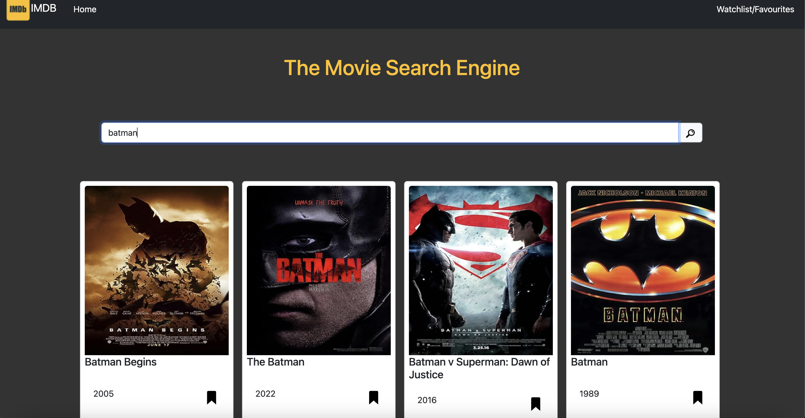
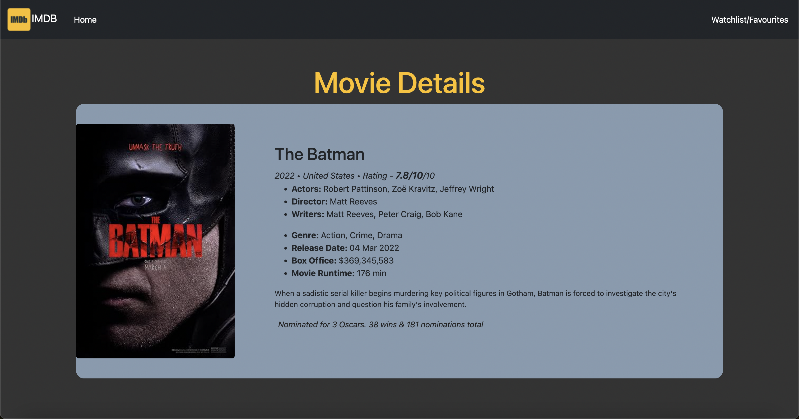
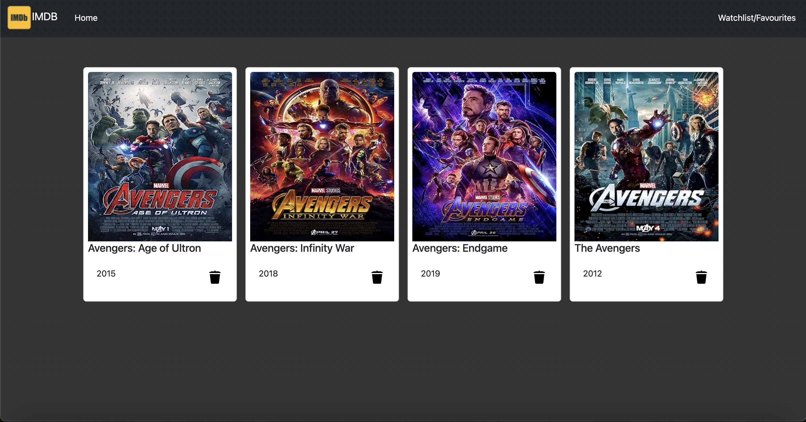

# IMDB-CLONE

 A mini IMDB clone app using vanilla js bootstrap

# Pages & Features
   1.   HOME Page 
    
a. Search any movie from the (OMBD)API and display the search results on the frontend (as we type the search results  updates, just like Google does for suggestions).

b. Each search result of the movie  have a favourite button, clicking on which the movie should be added to “Bookmark/Watchlist” .

c. On clicking any particular search result (any movie), open's a new page with more information about that movie (movie page)

2. Movie Page
a.  Shows information about the movie like its name, photo, plot, etc.

3. Watchlist/Favourites

a. Display's a list of all the favourite movies.

b. this list persistent  have the same number of movies before and after closing the browser/refreshing the browser.

c. Remove from favourites button: Each movie  have remove from bookmark button, clicking on which should remove that movie from the bookmarked list.

# Screenshots

Home page

Movies Page

WatchList Page

 

